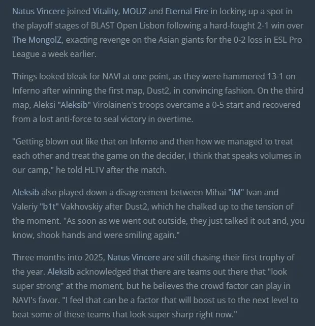

# Виконав: Солохненко Дмитро Сергійович, Група: ІПЗ-2.03

# Original Picture:
| |Jpg/Png|Resolution|Size|
|---|---|---|---|
|Photo|JPG|960x1280|157Kb |
|Screenshot|PNG|1918x1032|2841Kb |
|Text|PNG|620x641|114Kb |

# Зоображення до переробки:
### Original Photo.jpg

### Original Screen.png

### Original Text.png

# Порівняння варіантів стиснення (50)
AVIF 50% vs MozJPEG 50% vs WebP (lossy) 50%
||Avif50|MozJpeg50|Webp50|
|---|---|---|---|
|Photo|73,6Kb|80,9Kb|85,9Kb|
|Screen|140Kb|124Kb|141Kb|
|Text|30Kb|27,9Kb|29,4Kb|
# Avif50
### Avif50 Photo

### Avif50 Screen

### Avif50 Text

# MozJpeg50

### MozJpeg50 Photo

### MozJpeg50 Screen

### MozJpeg50 Text

# Webp50

### Webp50 Photo

### Webp50 Screen

### Webp50 Text

# Порівняння варіантів стиснення (75)
AVIF 75% vs MozJPEG 75% vs WebP (lossy) 75%
||Avif75|MozJpeg75|Webp75|
|---|---|---|---|
|Photo|143Kb|145Kb|117Kb|
|Screen|259Kb|196Kb|184Kb|
|Text|42,4Kb|42,2Kb|35,7Kb|

# Avif75
### Avif75 Photo

### Avif75 Screen

### Avif75 Text

# MozJpeg75

### MozJpeg75 Photo

### MozJpeg75 Screen

### MozJpeg75 Text

# Webp75

### Webp75 Photo

### Webp75 Screen

### Webp75 Text

# Порівняння варіантів стиснення (100)
AVIF 100% vs MozJPEG 100% vs WebP (lossy) 100%
||Avif100|MozJpeg100|Webp100|
|---|---|---|---|
|Photo|281Kb|448Kb|392Kb|
|Screen|815Kb|1392Kb|655Kb|
|Text|83,1Kb|211Kb|84,5Kb|

# Avif100
### Avif100 Photo

### Avif100 Screen

### Avif100 Text

# MozJpeg100

### MozJpeg100 Photo

### MozJpeg100 Screen

### MozJpeg100 Text

# Webp100

### Webp100 Photo

### Webp100 Screen

### Webp100 Text

# Порівняння варіантів стиснення webp(loseless)

||Webp(loseless)|
|---|---|
|Photo|912Kb|
|Screen|1828Kb|
|Text|28,4Kb|

# Webp(loseless)
### Webp(l) Photo
.webp)

### Webp(l) Screen
.webp)

### Webp(l) Text
.webp)

# Resize(оптимізація розміру)

||Mobile(600)|Web(1200)|2x|
|---|---|---|---|
|Photo|460Kb|1392Kb|2785Kb|
|Screen|175Kb|672Kb|5206Kb|
|Text|307Kb|811Kb|878Kb|

### Mobile(600) Photo

### Web(1200) Photo

### 2x Photo

### Mobile(600) Screen

### Web(1200) Screen

### 2x Screen

### Mobile(600) Text

### Web(1200) Text

### 2x Text

## Висновки  

### Найкращий формат для кожного типу зображення:  
- **Фотографія:**  
  - *AVIF* — найкраще співвідношення "якість/вага файлу" при стисненні з втратами.  
  - *WebP (lossless)* — для збереження якості без втрат.  

- **Скріншот:**  
  - *WebP (lossless)* зберіг чіткість дрібних деталей та тексту, маючи менший розмір, ніж PNG.  

- **Графічне зображення з текстом:**  
  - *MozJPEG (75%)* дав хороший баланс між розміром і якістю.  
  - Для складних ілюстрацій — *WebP (lossless)*.  

---

### Вплив зміни розміру на оптимізацію:  
- **Для вебу:** зображення шириною **1200 px** значно зменшили вагу файлу без втрати якості.  
- **Для мобільних пристроїв:** зображення шириною **600 px** зменшили вагу файлу більш ніж удвічі.  
- **Для Retina-дисплеїв:** створення **2x/3x** версій забезпечило чіткість на високоякісних дисплеях, хоч і збільшило вагу файлу.  

---

### Адаптація для Retina-дисплеїв:  
- **Базове зображення** — для звичайних дисплеїв.  
- **2x/3x версії** — для Retina.  
- **`srcset`** в HTML автоматично вибирає найкращу версію зображення для пристрою.  

---

### Загальний підсумок:  
- **WebP** — найуніверсальніший формат.  
- **AVIF** — ідеальний для фотографій із мінімальною втратою якості.  
- **PNG/WebP (lossless)** — найкращі для текстових і графічних зображень.  

Оптимізація зображень дозволяє досягти балансу між якістю, розміром і швидкістю завантаження, що критично важливо для сучасних веб- і мобільних застосувань. 